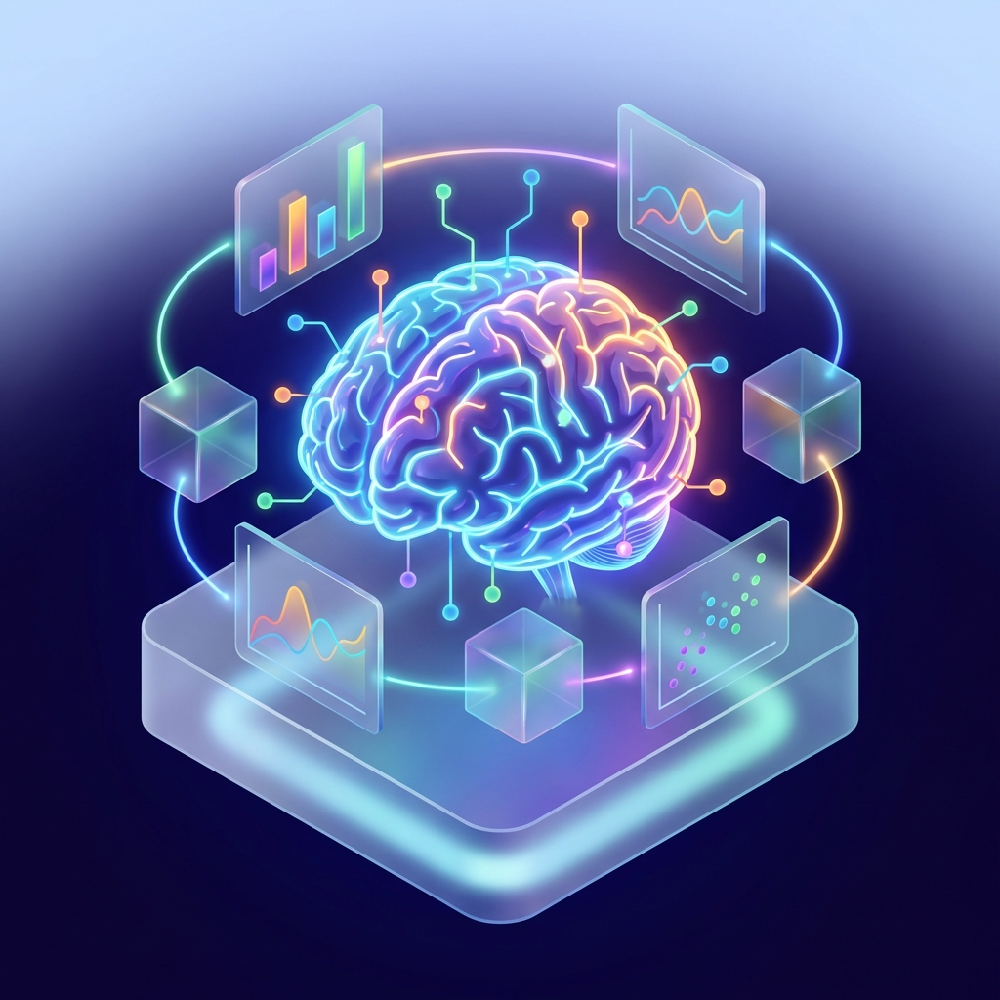

# 🤖 Aprendizaje Automático (Machine Learning)

Este módulo se enfoca en los fundamentos y aplicaciones de algoritmos de aprendizaje supervisado y no supervisado. 📈

## 📑 Contenido

### 🟢 Unidad 1: Aprendizaje Supervisado
*   **Actividad 3**: Modelos de regresión y clasificación. ⚖️
*   **Actividad 5**: Evaluación de modelos. ✅
*   **Actividad 8**: Implementación de algoritmos supervisados. 🛠️

### 🔵 Unidad 2: Aprendizaje No Supervisado
*   **Actividad 9**: Recomendación de películas utilizando técnicas de filtrado. 🎬
*   **Actividad 10**: 
    *   Agrupamiento (Clustering) de imágenes. 🖼️
    *   Codificación de texto y embeddings. 🔤
*   **Actividad 11**: Proyecto final de agrupamiento y análisis no supervisado. 🏆

## 🛠️ Tecnologías
*   Python (Scikit-Learn, Pandas, NumPy, Matplotlib) 🐍
*   Jupyter Notebooks 📓

