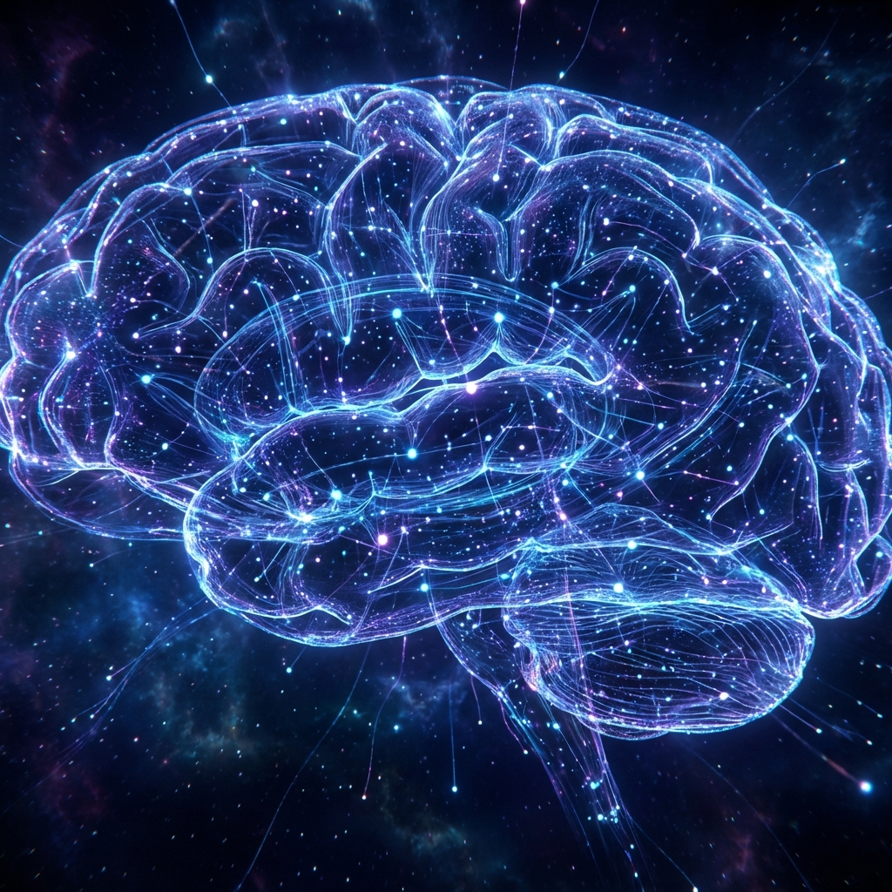

# 🧠 Aprendizaje Profundo (Deep Learning)

Estudio de redes neuronales profundas, arquitecturas avanzadas y sus aplicaciones en visión por computador y procesamiento de secuencias. 🌊

## 📂 Unidades Temáticas

*   **1️⃣ Unidad 1: Introducción**: Conceptos básicos y perceptrón multimapa.
*   **2️⃣ Unidad 2: Redes Neuronales**: Implementación y optimización de redes densas.
*   **3️⃣ Unidad 3: CNNs**: Redes Neuronales Convolucionales para clasificación de imágenes. 🖼️
*   **4️⃣ Unidad 4: GANs**: Redes Generativas Adversarias. 🎨
*   **5️⃣ Unidad 5: Modelos Secuenciales**: RNNs y LSTMs para datos temporales. ⏳
*   **6️⃣ Unidad 6: Transformers**: Mecanismos de atención y arquitecturas Transformer. ⚡

## 🚀 Proyectos Destacados
*   🛢️ Clasificación de pozos petroleros (Deep Learning aplicado).
*   🎭 Generación de imágenes con GANs.
*   📈 Análisis de series temporales.

## 🛠️ Tecnologías
*   TensorFlow / Keras 🧱
*   PyTorch 🔥
*   Python 🐍

