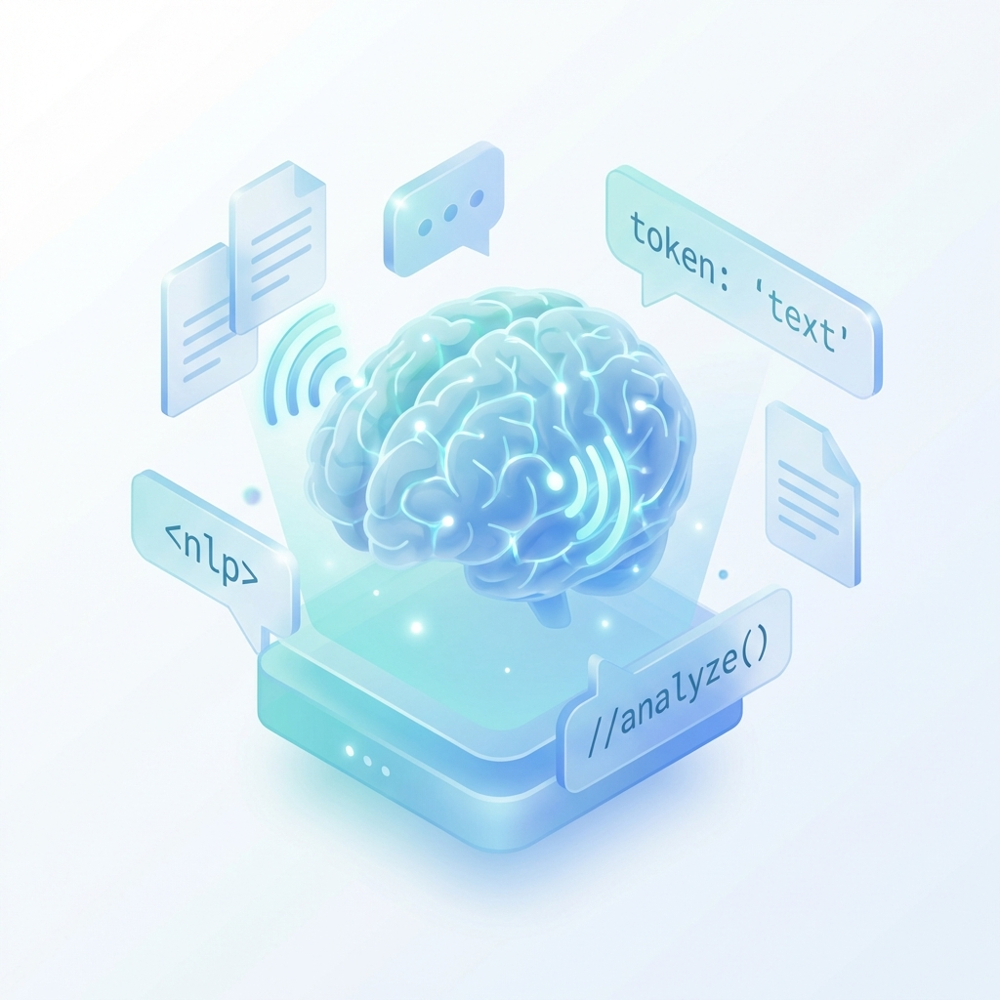

# 🗣️ Procesamiento de Lenguaje Natural (NLP)

Desarrollo de sistemas capaces de entender, interpretar y generar lenguaje humano. 📚

## 📑 Contenido

*   **1️⃣ Unidad 1: Introducción**: Técnicas de preprocesamiento de texto y modelos Bag-of-Words. ✂️
*   **2️⃣ Unidad 2: Aplicaciones**: Uso de GloVe (Global Vectors para representación de palabras) y Word2Vec. 🌐
*   **3️⃣ Unidad 3: LLMs y RAG**: 
    *   Trabajo con Grandes Modelos de Lenguaje (LLMs). 🤖
    *   Implementación de Sistemas RAG (Retrieval-Augmented Generation) para consultas sobre documentos. 🔍

## 🛠️ Herramientas
*   NLTK / Spacy 📦
*   Hugging Face Transformers 🤗
*   LangChain 🔗
*   OpenAI API / Modelos locales ☁️

